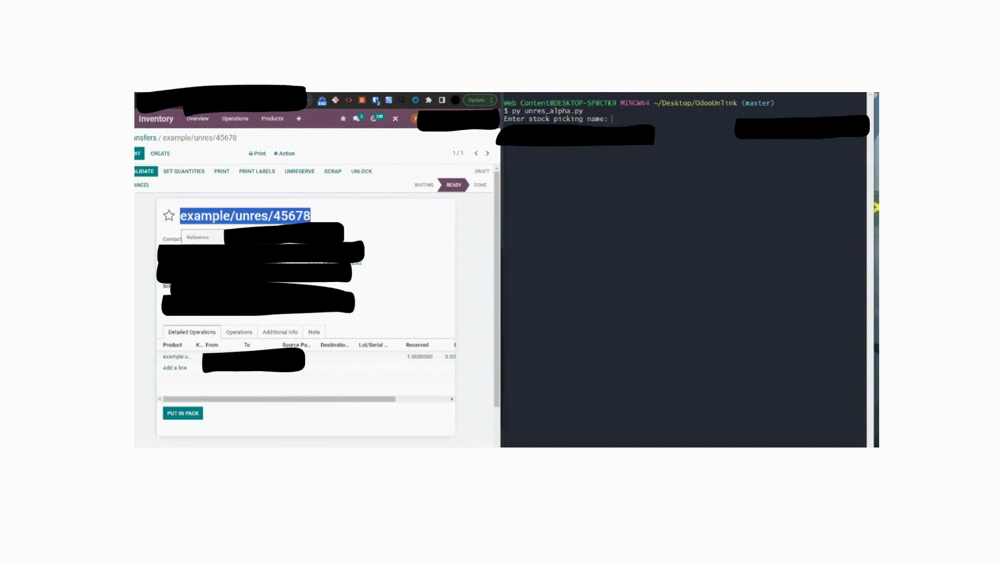

# Odoo-Unable-to-Unreserve-Fix-Script
Have you been hit with the "It is not possible to unreserve more products of ... than you have in stock." bug? Run this script to solve your issues. *** Test before ruining on a production environment 

## Directory Structure

- `2022/`: This directory contains the minimal version of the script. It's a command-line based Python script that interacts directly with an Odoo server over XML-RPC.
-  The script prompts the user to input the details of the stock quantities to unreserve and provides the option to overwrite these quantities.
-   For more details on how to use the original script, please refer to the README file within the `2022/` directory.

## 2023 Update
I have updated the script to be a more robust CLI. After speaking with various devs and implementers 99% of the issues came from the stock.picking model. So rather than make a complex GUI or web app, I decided to go the CLI route and focus on fixing the bugged record quickly. 

## How to Run

1. Clone the repo or download the script.
   
3. Open the script in your text editor to configure the Odoo server details:

   ```python
   db = 'your_database_name'
   url = 'your_server_url'
   username = 'your_username'
   password = 'your_password'
   ```

4. Run the script using Python:

   ```bash
   python unres_alpha.py
   ```

5. When prompted, enter the stock picking name.

6. The script will take the product id and location id, look up stock.quants, and if there is a situation where the stock.move.line record has more reserved than the amount in the stock.quant model, you will be given the option to overwrite.

7. After this, you should be able to close the bugged moved. 

# Demo



## Additional Notes

- The script uses an unverified SSL context. This is not recommended for production use. Make sure to use verified SSL certificates for secure connections.

- The Odoo server must have XML-RPC enabled, and you must have the necessary permissions to perform stock-related operations.

- Due to the nature of Odoo having multiple stock.quant of the same product, and location but could be diffrent lot codes, I added a bit of logic to loop the stock.quant, this is not the cleanest but it gets the job done. 


## Contributions

Contributions to this project are welcome. If you encounter any issues or have suggestions for improvements, please open an issue or submit a pull request.

## License

This project is open source and available under the [MIT License](LICENSE).

